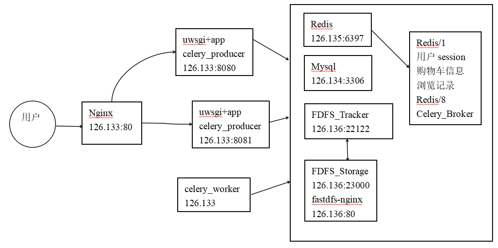
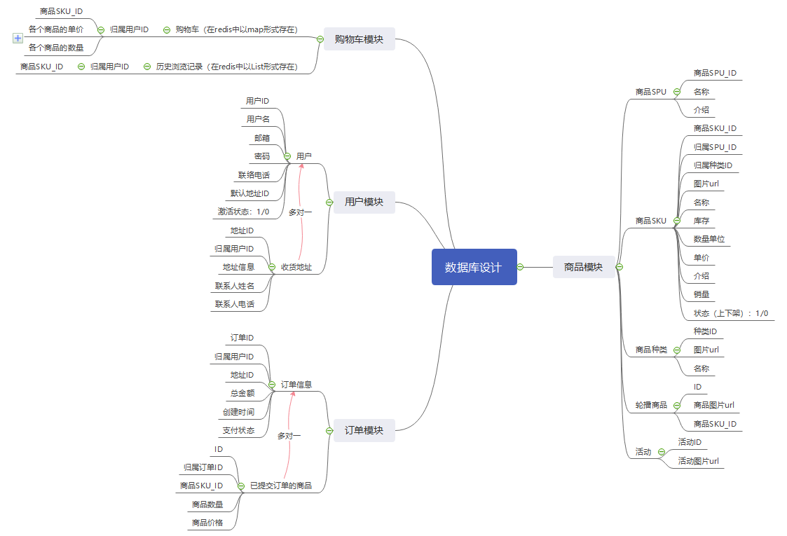

# 
shopping-web购物商场

***

## 技术栈
- 语言：Python3 (Django)
- 数据库: MySql、 redis
- 任务队列(异步处理): celery
- 分布式文件存储: FastDFS
- web服务器配置: Nginx + uwsgi
- 开发环境： VSCode、Linux、vim
- 版本控制工具：git、 github、 gitbook

## 技术架构
- 开发架构

- 部署架构

## 主题模块
- 用户模块
- 商品模块
- 购物车模块
- 订单模块

## 数据库设计
