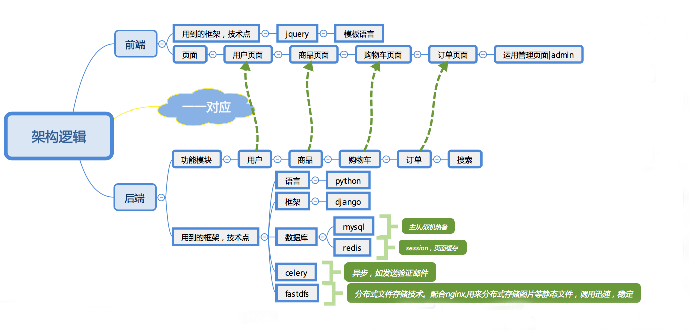

# 
shopping-web购物商场

***

## 技术栈
- 语言：Python3 (Django)
- 数据库: MySql、 redis
- 任务队列(异步处理): celery
- 分布式文件存储: FastDFS
- web服务器配置: Nginx + uwsgi
- 开发环境： VSCode、Linux、vim
- 版本控制工具：git、 github、 gitbook

## 技术架构
- 开发架构

- 部署架构

## 主题模块
- 用户模块
- 商品模块
- 购物车模块
- 订单模块

## 数据库设计

- SPU是商品信息聚合的最小单位，是一组可复用、易检索的标准化信息的集合，该集合描述了一个产品的特性。通俗点讲，属性值、特性相同的商品就可以称为一个SPU。
例如，iphoneX就是一个SPU，这个与商家无关，与颜色、款式、套餐也无关。
- SKU即库存进出计量的单位， 可以是以件、盒、托盘等为单位，在服装、鞋类商品中使用最多最普遍。
例如纺织品中一个SKU通常表示：规格、颜色、款式。